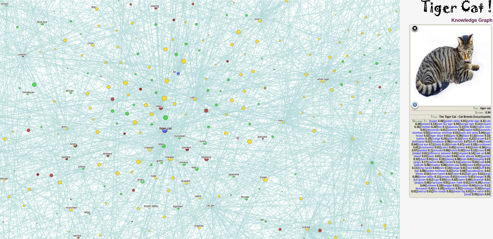

# CuImage Dynamic Knowledge Graph


This repo is an implementation of knowledge graph visualization on billion web images in ["cuimage: a neverending learning platform on a convolutional knowledge graph of billion web images"](https://arxiv.org/abs/2107.03609), accepted by Big Data 2018. 




[Here](https://lingyunwu14.github.io/mia-graph-show/) is an example of "TigerCat" to visualization. Click on any node to see its corresponding picture, and its related nodes will be displayed at the same time. You can also zoom in or out by sliding the mouse wheel. More fun operations are waiting for you to explore!


## Citing
Any pull requests or issues are welcomed. Please cite our paper in your publications if it helps your research:
```
@inproceedings{peng2018cuimage,
  title={Cuimage: A neverending learning platform on a convolutional knowledge graph of billion web images},
  author={Peng, Zhanglin and Wu, Lingyun and Ren, Jiamin and Zhang, Ruimao and Luo, Ping},
  booktitle={2018 IEEE International Conference on Big Data (Big Data)},
  pages={1787--1796},
  year={2018},
  organization={IEEE}
}
```
